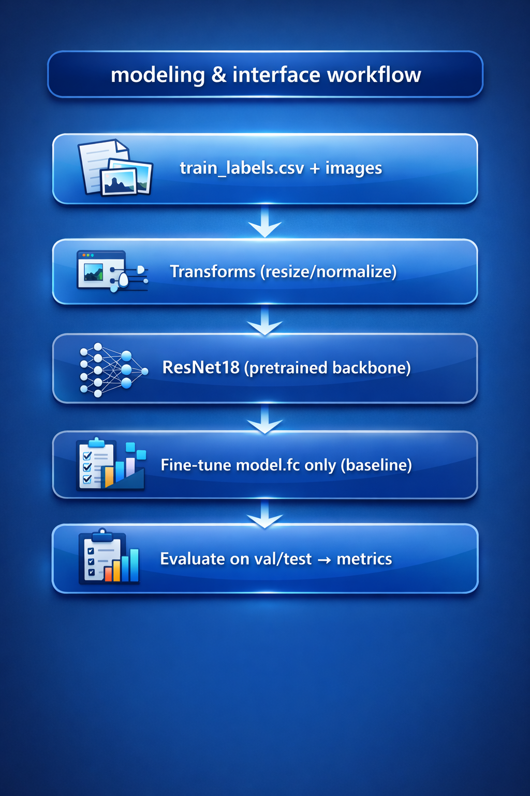
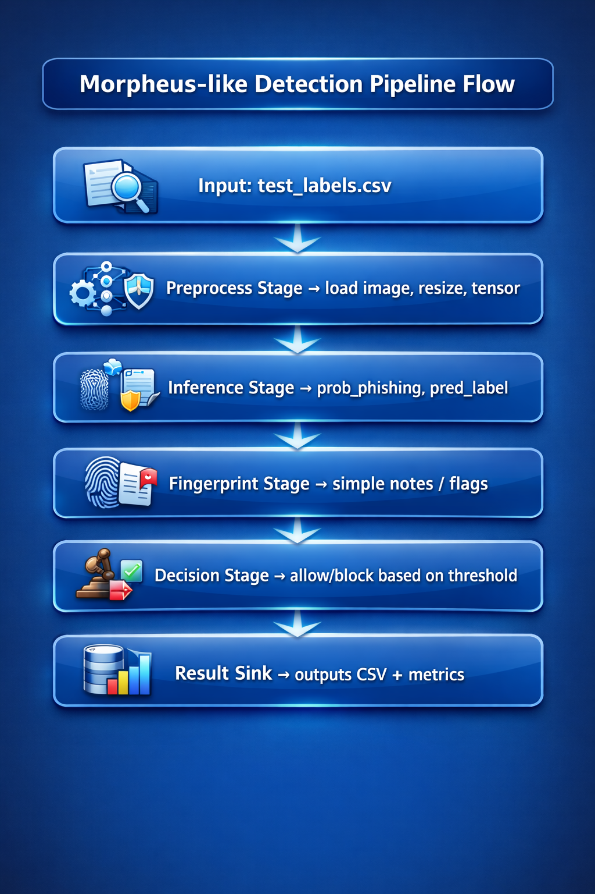

# Phishing Detection via Image-Based Techniques

This project focuses on detecting phishing webpages using **image-based techniques**.  
We classify website screenshot images as **phishing** or **benign**, using a deep learning baseline model and a Morpheus-like pipeline flow.

The project includes dataset preparation, exploratory data analysis (EDA), transfer learning with ResNet18, pipeline simulation, and robustness testing.

---

## Project Goals

- Detect phishing websites based on screenshot images  
- Train a baseline deep learning classifier (ResNet18)  
- Report standard evaluation metrics (Precision, Recall, F1, Confusion Matrix)  
- Simulate a Morpheus-style detection pipeline:
  preprocess → inference → fingerprinting → decision → output  
- Perform basic security robustness testing using image perturbations

---

## Repository Structure

Expected folder structure:

```

PhishingProjectV2/
├── main_pipeline.ipynb
├── README.md
├── diagrams/
│   ├── modeling_workflow.png
│   ├── pipeline_inference_flow.png
├── splits/
│   ├── labels.csv
│   ├── train_labels.csv
│   ├── val_labels.csv
│   └── test_labels.csv
└── data/
├── benign/
└── phishing/

```

---

## Dataset Format

The dataset is organized into two folders:

- `data/benign/` → legitimate website screenshots  
- `data/phishing/` → phishing website screenshots  

CSV label files are stored in `splits/`.

Each CSV contains:

- `filepath` : relative path to the image  
- `label` : `0` (benign) or `1` (phishing)  
- `class` : text label (`benign` / `phishing`)

Example:

```

data/phishing/img_001.png , 1 , phishing

````

> Important: Filepaths must remain **relative** so the project works on any machine.

---

## Workflow Diagrams

### Baseline Model Training Flow



---

### Morpheus-like Detection Pipeline Flow



---

## Installation

Install all required Python libraries:

```bash
pip install -r requirements.txt
````

---

## User Instructions 

### Option A (Recommended): Run in Jupyter Notebook

1. **Clone or download the repository**

```bash
git clone <REPO_URL>
cd PhishingProjectV2
```

Or download as ZIP and extract the folder.

---

2. **Ensure the dataset folders exist**

Place images inside:

* `data/benign/`
* `data/phishing/`

---

3. **Start Jupyter Notebook from the project directory**

```bash
jupyter notebook
```

---

4. **Open and run the notebook**

Open:

* `main_pipeline.ipynb`

Run all cells in order, or use:

* Kernel → Restart & Run All

---

5. **Expected Outputs**

Running the notebook produces:

* Dataset splits (train/val/test CSVs)
* EDA plots and sample visualizations
* Training logs (loss + accuracy)
* Test metrics (Precision/Recall/F1 + Confusion Matrix)
* Pipeline decisions (allow/block)
* Robustness evaluation under perturbations

---

### Option B: Run as Python Script (Optional)

If a script version exists:

```bash
python pipeline.py
```

---

## Project Stages (Course Mapping)

1. **Dataset Preparation**

   * Build labeled CSV files from image folders
   * Stratified train/validation/test split

2. **EDA**

   * Class distribution
   * Image resolution statistics
   * Sample visualizations

3. **Modeling & AI Integration**

   * Baseline ResNet18 pretrained backbone
   * Fine-tuning only the classifier head (`model.fc`)
   * Weighted loss to handle class imbalance

4. **Pipeline Simulation (Morpheus-like)**

   * Preprocessing stage
   * Inference stage
   * Fingerprinting stage
   * Decision stage (allow/block)
   * Result sink (CSV + metrics)

5. **Security Testing / Robustness**

   * Performance under blur/brightness perturbations
   * Discussion of evasion risks

---

## Key Metrics Reported

* Accuracy
* Precision
* Recall
* F1 Score
* Confusion Matrix

---

## Responsible AI & Safety Notes

* This is a research prototype, not a production security system
* No live URLs are executed
* Results may include false positives/false negatives
* Threshold tuning and human review are recommended for real deployment

---

## Known Limitations & Vulnerabilities

* Dataset bias: model may learn template artifacts instead of phishing logic
* Generalization risk: phishing pages evolve quickly
* Evasion: small visual perturbations can reduce detection confidence
* Threshold sensitivity: decision boundary affects FP/FN tradeoff

---


