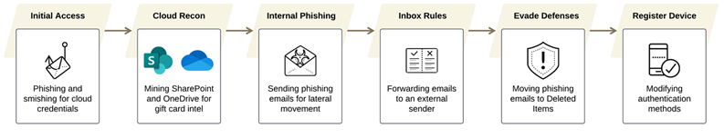

# Lab Work 1 – Cyber Threat Intelligence Report  
## Mapping Tactics and Techniques

**Names of the students:**
- Ruth Dubinsky  
- Dana Savenko

**Link to the source CTI report:**  
[Jingle Thief – Microsoft Threat Intelligence](https://unit42.paloaltonetworks.com/cloud-based-gift-card-fraud-campaign/)

## Short Description
This report describes how the attacking group infiltrated global enterprises in the retail and consumer services sectors, and how, by taking advantage of the organizations' cloud services, they managed to issue themselves gift cards, which they later sold for their own profit.

## Schema

## Explanation
1. Phishing and smishing for cloud credentials  
   The attackers used phishing emails and SMS messages to lure employees into logging in to a counterfeit Microsoft 365 portal, capturing their credentials.  

2. Mining SharePoint and OneDrive for gift card intel  
   After gaining initial access, the attackers gathered intelligence regarding gift card workflows, financial processes, and related information from internal documentation.  

3. Sending phishing emails for lateral movement  
   Attackers used phishing emails from already compromised accounts to move laterally within organizations, gaining more access across cloud systems.  

4. Forwarding emails to an external sender  
   Automatic email forwarding was set up to collect sensitive information and maintain access even after detection.  

5. Moving phishing emails to Deleted Items  
   This hides traces and reduces chances of detection by defenders.  

6. Modifying authentication methods  
   Attackers changed MFA settings or added their own authentication methods to maintain persistent access.

## Enterprise Tactics
- Reconnaissance
- Initial Access
- Persistence
- Defense Evasion
- Credential Access
- Discovery
- Lateral Movement
- Collection
- Exfiltration
- Resource Development

## Reconnaissance

| Technique | Description | Relation to Jingle Thief |
|----------|------------|--------------------------|
| T1592 – Gather Victim Host Information |Collecting information about cloud hosts and environments using legitimate cloud accounts. | They gather intelligence on each target, including branding, login portals, email templates and domain naming conventions. |
| T1589 – Gather Victim Identity Information | Collecting identity information about users. | Helps identify which employees to target via phishing and smishing. |
| T1589.001 – Credentials | Collecting or abusing valid cloud credentials. |The messages lure victims to counterfeit Microsoft 365 login portals that mimic legitimate sign-in pages – in this way they steal the credentials.|
|T1589.002 – Email Addresses | Collecting employee email addresses.|The threat actors collected employee email addresses, then used them to launch targeted phishing and SMS-based smishing campaigns, leading victims to counterfeit Microsoft 365 login portals |
| T1589.003 – Employee Names|Collecting employee names to support targeting. | The attackers gathered employees' names and used it to address them directly, making the messages look personal and legitimate |
|T1591 – Gather Victim Organization Information |Collecting information about organizational structure.| The attackers conducted extensive reconnaissance inside the Microsoft 365 environment, gathering organizational information from SharePoint and OneDrive to understand internal structures, workflows, and business processes. |
| T1591.003 – Identify Business Tempo|Identifying business activity patterns. | The attackers often align their activity with holiday periods, increasing operations during times of reduced staffing and heightened gift card spending. |
| T1591.004 – Identify Roles |Identifying roles inside the organization. | The threat actors conducted reconnaissance to map the environment and check who's in charge of issuing gift cards. |
| T1566.002 – Spearphishing Link | Sending targeted phishing emails with malicious links. | The attackers used phishing and smishing to steal credentials, to compromise organizations that issue gift cards.  |

## Initial Access

| Technique | Description | Relation to Jingle Thief |
|----------|------------|--------------------------|
| T1566 | Phishing | Gained access via targeted phishing emails |
| T1078.004 | Valid Accounts (Cloud) | Used compromised accounts to log in |

## Persistence

| Technique | Description | Relation to Jingle Thief |
|----------|------------|--------------------------|
| T1098 | Account Manipulation | Modified accounts to maintain access |
| T1098.001 | Additional Cloud Credentials | Added OAuth/refresh tokens to preserve access |
| T1098.005 | Device Registration | Registered rogue devices to bypass MFA |
| T1671 | Cloud Application Integration | Hijacked OAuth apps to maintain access |

## Defense Evasion

| Technique | Description | Relation to Jingle Thief |
|----------|------------|--------------------------|
| T1564.008 | Email Hiding Rules | Created inbox rules to forward emails |
| T1656 | Impersonation | Pretended to be trusted organizations |
| T1036 | Masquerading | Used deceptive URLs |
| T1078 | Valid Accounts | Used legitimate accounts to evade detection |
| T1070.008 | Clear Mailbox Data | Moved sent/reply emails to Deleted Items |

## Credential Access

| Technique | Description | Relation to Jingle Thief |
|----------|------------|--------------------------|
| T1111 | MFA Interception | Registered rogue authenticator apps to bypass MFA |

## Collection

| Technique | Description | Relation to Jingle Thief |
|----------|------------|--------------------------|
| T1530 | Data from Cloud Storage | Accessed SharePoint/OneDrive data |
| T1213.002 | SharePoint | Collected data from SharePoint repositories |

## Exfiltration

| Technique | Description | Relation to Jingle Thief |
|----------|------------|--------------------------|
| T1020 | Automated Exfiltration | Forwarded emails automatically |
| T1537 | Transfer Data to Cloud Account | Transferred data to attacker-controlled cloud accounts |

## Discovery

| Technique | Description | Relation to Jingle Thief |
|----------|------------|--------------------------|
| T1087 | Account Discovery | Identified user/service accounts |
| T1526 | Cloud Service Discovery | Identified cloud services in use |
| T1580 | Cloud Infrastructure Discovery | Mapped virtual machines, Citrix, VPNs |

## Lateral Movement

| Technique | Description | Relation to Jingle Thief |
|----------|------------|--------------------------|
| T1021 | Remote Services | Accessed additional accounts using stolen credentials |
| T1550 | Use of Alternate Authentication Material | Used stolen tokens/rogue devices to bypass MFA |

## Resource Development

| Technique | Description | Relation to Jingle Thief |
|----------|------------|--------------------------|
| T1586.002 | Email Accounts | Compromised email accounts to launch phishing |
| T1586.003 | Cloud Accounts | Compromised cloud accounts for operations |
