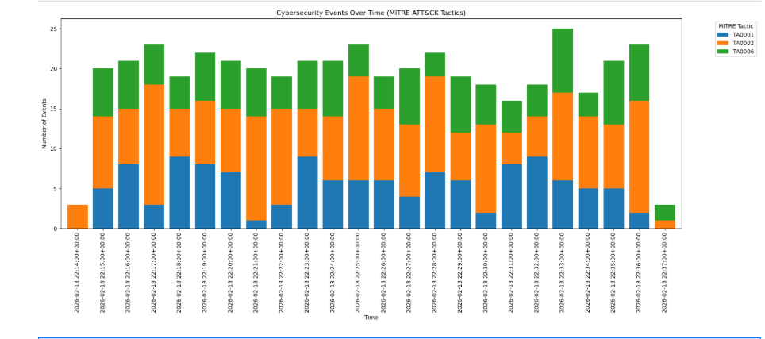

Event-Driven Cybersecurity Pipeline 🛡️
Overview
This project implements a simplified, high-performance cybersecurity analysis pipeline based on an event-driven architecture. The system is designed to simulate a real-world Security Operations Center (SOC) environment, demonstrating how to ingest, stream, and classify security events in real-time.

The core objective is to decouple data generation from heavy processing tasks using Apache Kafka, while maintaining full visibility through distributed tracing with Jaeger.

Architecture
The pipeline consists of three main stages:

Producer (Log Simulator): Generates synthetic Windows security logs (Process starts, User logins) and pushes them to a Kafka topic.

Message Broker (Kafka): Acts as the central nervous system, buffering and streaming events asynchronously.

Consumer (MITRE Classifier): Consumes the raw events, classifies them against the MITRE ATT&CK framework, and exports tracing data.

Key Features

Asynchronous Processing: The system can handle high bursts of traffic without blocking the ingestion source.
+1

MITRE ATT&CK Mapping: Automated classification of events into tactics such as Initial Access (TA0001) and Execution (TA0002).
+1

Distributed Tracing: Integration with OpenTelemetry and Jaeger for monitoring end-to-end latency and identifying bottlenecks.

Scalability: Each component is containerized and can be scaled independently to handle increased load.

Technology Stack
Language: Python

Streaming: Apache Kafka (Confluent Cloud/Local)

Tracing: OpenTelemetry, Jaeger

Visualization: Matplotlib, Redpanda Console

Containerization: Docker & Docker Compose

Implementation Details
Tracing Logic
Each event is assigned a unique trace_id derived from its event_id. This allows security analysts to follow the "story" of a single packet as it moves through the infrastructure.
+1

Performance Monitoring
The system tracks Consumer Lag to ensure that processing keeps up with ingestion. If the consumer becomes slower than the producer, events are safely buffered in Kafka until resources are available.
+1

Visual Evidence
Cybersecurity Events Over Time
The following statistics demonstrate the distribution of detected tactics during the simulation: 

Distributed Tracing (Jaeger)
The trace below captures the end-to-end latency of a single event flowing through the system: 